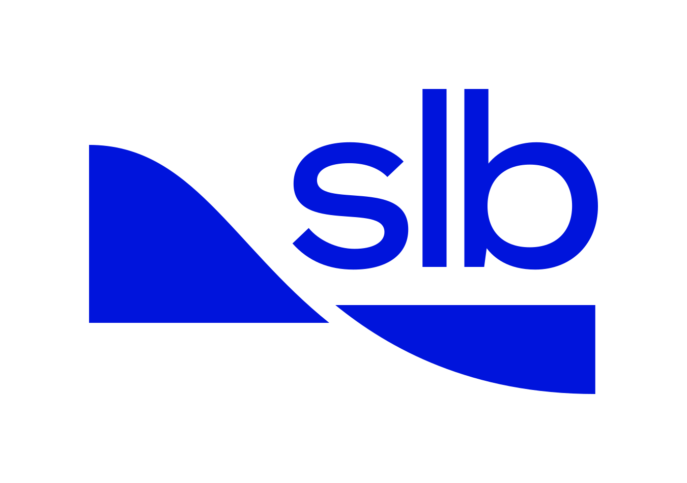

Co-located with [EMNLP 2026](https://2026.emnlp.org/) in Budapest, Hungary &mdash; **October 28, 2026**.

While Large Language Models (LLMs) have revolutionized NLP, they remain prone to hallucinations, reasoning "mode-collapse" in open-ended generation, and a lack of factual provenance. The Automated Knowledge Base Construction (AKBC) workshop addresses a key missing piece of the generative era: structured knowledge. Knowledge Bases (KBs) serve as ground truth for fact verification, the semantic backbone for constrained decoding in generation, and as a resource behind Retrieval-Augmented Generation (RAG).

The workshop contributes to the growing momentum around integrating structured knowledge into generative models, both at training time and at inference time.

It follows a successful series of previous editions: as an independent conference in [2022](https://akbc.ws/2022), [2021](https://akbc.ws/2021), and [2020](https://akbc.ws/2020), as workshop in [2017 at NIPS](https://akbc.ws/2017), in [2016 at NAACL](https://akbc.ws/2016), in [2014 at NIPS](https://akbc.ws/2014), in [2013 at CIKM](https://akbc.ws/2013), in [2012 at NAACL](https://akbc.ws/2012), and in 2010 as a stand-alone event in Grenoble, France.

<a class="linkedin-callout" href="https://www.linkedin.com/company/akbc-workshop/" target="_blank" rel="noopener">
  
  
    <strong>Stay in the loop.</strong>
    Follow AKBC on LinkedIn for deadlines, speaker announcements, and shared task updates.
  
  Follow &rarr;
</a>

Sponsored by  and .

## News

- We are grateful to our sponsors [Bloomberg](http://bloomberg.com/) and [SLB}(https://www.slb.com/)!
- September 8th, 2026: Out of 58 submissions, 27 papers were accepted &mdash; see the [list of accepted papers]({{ site.baseurl }}/#papers)
- September 8th, 2026: [Parisa Kordjamshidi](https://www.cse.msu.edu/~kordjams/) (Michigan State University) is confirmed as a keynote speaker
- September 1st, 2026: Shared task results are out &mdash; see the winners on the [shared task page]({{ site.baseurl }}/shared-task.html) and the [full final leaderboard](https://www.akbc.ws/2026/AKBC%20Shared%20Task%202026%20Final%20Leaderboard.pdf)
- August 12th, 2026: [Denny Vrandečić](https://en.wikipedia.org/wiki/Denny_Vrande%C4%8Di%C4%87) (Wikimedia) is confirmed as a keynote speaker
- July 30th, 2026: [Amir Globerson](https://cs3801.wixsite.com/amirgloberson) (Tel Aviv University &amp; Google) is confirmed as a keynote speaker
- July 23rd, 2026: [Dan Roth](https://www.cis.upenn.edu/~danroth/) (University of Pennsylvania &amp; Oracle) is confirmed as a keynote speaker
- May 28th, 2026: [Alon Halevy](https://en.wikipedia.org/wiki/Alon_Halevy) (Google) is confirmed as a keynote speaker
- May 27th, 2026: The workshop day is fixed to **October 28, 2026**
- May 21st, 2026: We are excited to announce [Heng Ji](https://siebelschool.illinois.edu/about/people/faculty/hengji) (UIUC) as a keynote speaker
- May 21st, 2026: We are excited to announce [Mausam](https://www.cse.iitd.ac.in/~mausam/) (IIT Delhi) as a keynote speaker
- April 27th, 2026: We receive news that the workshop will be held on October 28, 2026
- April 13th, 2026: The Web page of AKBC goes live

## Important Dates

<table class="dates-table">
  <tbody>
    <tr><td>Direct submission (research + vision)</td><td>July 27, 2026</td></tr>
    <tr><td>Direct submission (shared task)</td><td>August 15, 2026</td></tr>
    <tr><td>ARR commitment (research)</td><td>August 25, 2026</td></tr>
    <tr><td>Notification of acceptance</td><td>September 1, 2026</td></tr>
    <tr><td>Camera ready due</td><td>September 10, 2026</td></tr>
    <tr><td>Workshop date</td><td>October 28, 2026</td></tr>
  </tbody>
</table>

## Call for Papers

The 11th Workshop on Automated Knowledge Base Construction (AKBC) returns in 2026, bringing together researchers and practitioners working on the construction, integration, and use of structured knowledge in the era of large language models (LLMs). As LLMs continue to transform NLP, challenges such as hallucinations, lack of provenance, and limited reasoning reliability highlight the need for robust, explicit, and usable knowledge representations. AKBC sits at the intersection of natural language processing, knowledge representation, databases, and machine learning, with a particular focus on how symbolic structure can ground, constrain, and enhance generative models.

Topics of interest include, but are not limited to:

- **Knowledge for generative models:** knowledge-aware pretraining and fine-tuning; factuality, attribution, and verification; neuro-symbolic and hybrid methods; injecting and editing knowledge in LLMs
- **Building and maintaining knowledge:** extraction and consolidation from text and multimodal data; knowledge graphs, ontologies, and schema alignment; KB construction, completion, and continual updates
- **Retrieval and reasoning:** retrieval-augmented generation with structured sources; graph-based and knowledge-intensive question answering; multi-hop reasoning and interaction with KBs
- **Vision papers:** new roles for structured knowledge in generative models; new architectures, benchmarks, and research agendas for knowledge-grounded generation; the future of knowledge bases, reasoning, and trustworthy AI

### Submission Types

- **Regular research papers** (8 pages + references), via [ARR commitment](https://openreview.net/group?id=EMNLP/2026/Workshop/AKBC_ARR_Commitment) or [direct submission](https://openreview.net/group?id=EMNLP/2026/Workshop/AKBC)
- **Vision papers** (4 pages + references), via [direct submission](https://openreview.net/group?id=EMNLP/2026/Workshop/AKBC): bold ideas, emerging directions, and unifying perspectives
- **Shared task papers** (4 pages + references), via [direct submission](https://openreview.net/group?id=EMNLP/2026/Workshop/LM-KBC_Shared_Task): system descriptions and analyses for the [AKBC shared task]({{ site.baseurl }}/shared-task.html)

All submissions follow the [EMNLP formatting instructions](https://2026.emnlp.org/calls/main_conference_papers/#paper-submission-details), are double-blind, and appear in the workshop proceedings, so double submissions to other venues with proceedings are not allowed. An optional limitations section and appendix do not count towards the page limit, but we cannot guarantee that the appendix will be part of the proceedings.

Accepted papers are presented as posters, with a selection invited for lightning talks. Remote participation is possible for attendees and authors; remote authors upload their poster to the workshop website instead of presenting physically.

## Accepted Papers

<ul class="papers-list">

  <li>{{ p.title }}{{ p.authors }}</li>

</ul>

## Shared Task

Large language models contain a substantial amount of factual knowledge. Turning that knowledge into reliable knowledge base entries, however, is much harder than answering a single factual question.

Given a subject *s* and a relation *r*, predict the complete set of correct object strings {o₁, o₂, …, oₖ}. Unlike standard factual QA, a subject may have zero, one, or many correct objects. The goal is to construct a complete and precise KB entry.

Further details are on the [shared task page]({{ site.baseurl }}/shared-task.html).

## Invited Speakers


  

    
    
<a href="{{ s.url }}">{{ s.speaker }}</a>

    
{{ s.institution }}

  



## Organization

### Organizing Committee

<ul class="organizers-list">

  <li><a href="{{ o.url }}">{{ o.name }}</a>{{ o.name }}, {{ o.location }}</li>

</ul>

Contact us at [akbc2026@gmail.com](mailto:akbc2026@gmail.com) for workshop inquiries, or at [akbc2026-shared-task@googlegroups.com](mailto:akbc2026-shared-task@googlegroups.com) for shared task inquiries.

### Program Committee

<ul>

  <li><a href="{{ p.url }}">{{ p.name }}</a>{{ p.name }} ({{ p.affiliation }})</li>

</ul>
